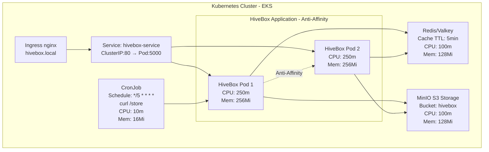

# HiveBox Project


## Overview

HiveBox is a production-grade Python Flask application that aggregates real-time temperature data from global sensors using the [OpenSenseMap](https://opensensemap.org/) API. The project demonstrates end-to-end DevOps practices with containerization, orchestration, and cloud deployment.

For more information please refer to the Project webpage: [HiveBox](https://devopsroadmap.io/projects/hivebox/)

### Application Features

- **Temperature Data API**: Fetches and processes data from thousands of global temperature sensors.
- **Intelligent Caching**: Redis-based caching with 5-minute TTL to optimize API performance.
- **Object Storage**: MinIO (S3-compatible) for persistent temperature data storage with automated CronJob uploads every 5 minutes.
- **Observability**: Prometheus metrics exposure for monitoring and alerting.
- **Health Probes**: Kubernetes-ready readiness and liveness endpoints with sensor availability checks.

### Technology Stack

- **[Application](./app/)**: Python with Flask framework.
  - `main.py`: API endpoints (/version, /temperature, /metrics, /store, /readyz).
  - `opensense.py`: OpenSenseMap API integration with streaming support.
  - `storage.py`: MinIO client for object storage operations.
  - `config.py`: Redis client configuration.
  - `readiness.py`: Sophisticated health check logic.

- **[Containerization](./Dockerfile)**: Security-hardened Alpine Linux images.
  - Multi-stage Docker builds with Python 3.13.7-alpine base.
  - Non-root user execution (UID 1000).
  - Pinned dependencies with hash verification in [requirements.txt](./requirements.txt).
  - Read-only filesystem with dropped capabilities.

- **Orchestration**: Kubernetes 1.31 with local development support.
  - **[Helm Charts](./helm-chart/)**: Package management with OCI registry support.
  - **[Kustomize](./kustomize/)**: Environment-specific configurations (staging/prod).
  - **Local Testing**: Minikube and Kind compatibility.

- **[Infrastructure as Code](./terraform/)**: AWS EKS deployment with Terraform.
  - VPC with public/private subnets across multiple availability zones.
  - EKS cluster v1.31 with managed node groups.
  - Modular design: VPC, EKS, IAM, Security Groups, Node Groups.
  - Optional ElastiCache and S3 modules.

- **CI/CD Pipeline**: GitHub Actions with comprehensive quality gates.
  - **Build & Test**: Automated Docker builds with integration testing.
  - **Code Quality**: SonarQube analysis with coverage reporting.
  - **Linting**: Pylint (Python), Hadolint (Docker), Kube-Linter (Kubernetes).
  - **Security Scanning**: Terrascan for IaC security analysis.
  - **Artifact Publishing**: Automatic image and Helm chart publishing to GHCR.
  - **Dependency Management**: Dependabot for automated security updates.

### Architecture Components

The application runs as a distributed system with three main services:

1. **HiveBox App** (2 replicas): Flask application with anti-affinity rules for high availability.
2. **Redis/Valkey** (1 replica): In-memory cache for API response optimization.
3. **MinIO** (1 replica): Object storage for historical temperature data.
4. **CronJob**: Periodic data storage trigger (every 5 minutes).

## Architecture Diagram



## API Endpoints

| Endpoint | Method | Description | Response |
|----------|--------|-------------|----------|
| `/version` | GET | Returns current application version | `Current app version: 0.7.1` |
| `/temperature` | GET | Fetches average global temperature from cached/live data | `Average temperature: XX.XX°C` + Pod IP |
| `/metrics` | GET | Prometheus metrics in text exposition format | Prometheus metrics data |
| `/store` | GET | Uploads current temperature data to MinIO S3 bucket | Storage confirmation message |
| `/readyz` | GET | Kubernetes readiness probe - checks sensor availability & cache status | `{"status": "ready"}` (200) or `{"status": "not ready"}` (503) |

### Readiness Probe Logic

The `/readyz` endpoint implements sophisticated health checking:
- **Sensor Check**: Validates >50% of sensors are reachable from OpenSenseMap API.
- **Cache Check**: Verifies Redis cache freshness (5-minute TTL).
- **Combined Logic**: Returns unhealthy (503) only when BOTH checks fail.
- **Use Case**: Kubernetes uses this for traffic routing decisions.

## Quick Start

### Prerequisites

- **Docker**: v20.10+.
- **Kubernetes**: v1.31+ (Minikube or Kind for local development).
- **Helm**: v3.0+.
- **kubectl**: Configured and connected to cluster.
- **(Optional) Terraform**: v1.0+ for AWS EKS deployment.

### Local Development with Docker

```bash
# Clone the repository
git clone https://github.com/GabrielPalmar/HiveBox-Project.git
cd HiveBox-Project

# Build the Docker image
docker build -t hivebox:0.7.1 .

# Run the application
docker run -d -p 5000:5000 hivebox:0.7.1

# Test the endpoints
curl http://localhost:5000/version
curl http://localhost:5000/temperature
curl http://localhost:5000/metrics
```

### Kubernetes Deployment with Helm

#### Using Helm from GHCR (Recommended)

```bash
# Install from GitHub Container Registry
helm install hivebox oci://ghcr.io/gabrielpalmar/hivebox-helm-charts/hivebox --version 0.7.1

# Access the application (if using Minikube)
minikube service hivebox-service

# Or via Ingress (add to /etc/hosts: <CLUSTER_IP> hivebox.local)
curl http://hivebox.local/temperature
```

#### Using Helm from Local Chart

```bash
# Install from local chart
helm install hivebox ./helm-chart

# Verify deployment
kubectl get pods -l app=hivebox
kubectl get svc hivebox-service

# Port forward for local access
kubectl port-forward svc/hivebox-service 8080:80

# Test the application
curl http://localhost:8080/temperature
```

#### Helm Configuration

Key values in [helm-chart/values.yaml](./helm-chart/values.yaml):

| Parameter | Default | Description |
|-----------|---------|-------------|
| `replicas.hivebox` | 2 | Number of HiveBox pod replicas |
| `images.hivebox` | ghcr.io/gabrielpalmar/hivebox:latest | HiveBox container image with SHA digest |
| `resources.hivebox.requests.cpu` | 250m | CPU request per pod |
| `resources.hivebox.requests.memory` | 256Mi | Memory request per pod |
| `ingress.enabled` | true | Enable/disable Ingress |
| `ingress.host` | hivebox.local | Ingress hostname |

### Kubernetes Deployment with Kustomize

```bash
# Deploy to staging environment
kubectl apply -k kustomize/overlays/staging

# Deploy to production environment
kubectl apply -k kustomize/overlays/prod

# Verify deployment
kubectl get deployments,pods,services,ingress -n <namespace>
```

### AWS EKS Deployment with Terraform

For detailed infrastructure deployment instructions, see [terraform/README.md](./terraform/README.md).

```bash
cd terraform

# Initialize Terraform
terraform init

# Review the execution plan
terraform plan

# Deploy infrastructure (EKS cluster, VPC, IAM, etc.)
terraform apply

# Configure kubectl
aws eks update-kubeconfig --region <region> --name <cluster-name>

# Deploy application using Helm
helm install hivebox oci://ghcr.io/gabrielpalmar/hivebox-helm-charts/hivebox --version 0.7.1
```

## CI/CD Pipeline

The project uses GitHub Actions for comprehensive CI/CD automation with multiple quality gates:

### Workflows

| Workflow | Trigger | Purpose |
|----------|---------|---------|
| [Build & Test](.github/workflows/build_test.yml) | Push/PR to `main` | Builds Docker image, runs container, executes integration tests |
| [Build & Push](.github/workflows/build_push.yml) | Push to `main` | Builds and pushes Docker image + Helm chart to GHCR with SHA256 digest |
| [Pylint](.github/workflows/pylint.yml) | Push/PR to `main` | Python code quality and standards enforcement |
| [SonarQube](.github/workflows/sonarqube.yml) | Manual | Code quality analysis: coverage, vulnerabilities, code smells |
| [Hadolint](.github/workflows/hadolint.yml) | Push/PR to `main` | Dockerfile best practices and security validation |
| [Terrascan](.github/workflows/terrascan.yml) | Push/PR to `main` | Terraform IaC security scanning and compliance |
| [Kube-Linter](.github/workflows/kube-linter.yml) | Push/PR to `main` | Kubernetes manifest validation for security and reliability |

### Dependency Management

**Dependabot** ([.github/dependabot.yml](.github/dependabot.yml)) automatically updates:
- **Python dependencies**: Weekly (pip)
- **Docker base images**: Weekly
- **GitHub Actions**: Weekly

### Quality Gates Summary

```
┌────────────────┐
│   Code Push    │
└───────┬────────┘
        │
        ├─────► Pylint ────────┐
        ├─────► Hadolint ──────┤
        ├─────► Kube-Linter ───┤
        ├─────► Terrascan ─────┤── All Pass? ──┐
        ├─────► Build & Test ──┤               │
        └─────► SonarQube ─────┘               │
                                                ▼
                                        ┌───────────────┐
                                        │  Build & Push │
                                        │   to GHCR     │
                                        └───────────────┘
                                                │
                                                ▼
                                        ┌───────────────┐
                                        │  Helm Chart   │
                                        │   Packaged    │
                                        └───────────────┘
```

## Configuration

### Environment Variables

Set in [Dockerfile](./Dockerfile) and configurable in Kubernetes:

| Variable | Default | Description |
|----------|---------|-------------|
| `FLASK_APP` | app.main:app | Flask application entry point |
| `PYTHONUNBUFFERED` | 1 | Disable Python output buffering |
| `REDIS_HOST` | redis | Redis service hostname |
| `REDIS_PORT` | 6379 | Redis service port |
| `REDIS_DB` | 0 | Redis database number |
| `CACHE_TTL` | 300 | Cache time-to-live (5 minutes) |
| `MINIO_HOST` | minio | MinIO service hostname |
| `MINIO_PORT` | 9000 | MinIO service port |
| `MINIO_ACCESS_KEY` | minioadmin | MinIO access credentials |
| `MINIO_SECRET_KEY` | minioadmin | MinIO secret credentials |

### Security Configuration

All containers run with hardened security contexts:

```yaml
securityContext:
  allowPrivilegeEscalation: false
  readOnlyRootFilesystem: true
  runAsNonRoot: true
  runAsUser: 1000
  runAsGroup: 1000
  capabilities:
    drop: ["ALL"]
  seccompProfile:
    type: RuntimeDefault
```

## Testing

### Run Integration Tests

```bash
# Install test dependencies
pip install -r requirements.txt
pip install vcrpy

# Run integration tests with VCR cassettes
python tests/test_main.py

# Run unit tests
python tests/test_modules.py
```

### Test Coverage

- Integration tests: API endpoint validation with mocked responses.
- Unit tests: Module-level functionality testing.
- VCR cassettes: Record/replay HTTP interactions for reproducible tests.
- CI pipeline: Automated testing on every PR/push.

## Monitoring & Observability

### Prometheus Metrics

Access metrics at `/metrics` endpoint:

```bash
curl http://hivebox.local/metrics
```

**Available metrics**:
- HTTP request counters.
- Response time histograms.
- Temperature data metrics.
- Cache hit/miss ratios.

### Health Checks

**Liveness Probe**: `/version`
- Simple endpoint to verify pod is alive.
- Checks: 60s interval, 3 failures trigger restart.

**Readiness Probe**: `/readyz`
- Complex health check with sensor + cache validation.
- Checks: 30s delay, 600s interval.
- Removes pod from service if unhealthy.

## Development

To adhere to industry standards, the Repository's Project section was used, leveraging the Kanban board to process tasks in an organized manner.

[Kanban Board](https://github.com/users/GabrielPalmar/projects/1)